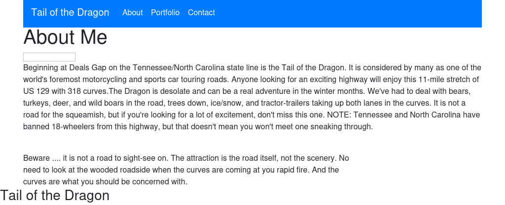
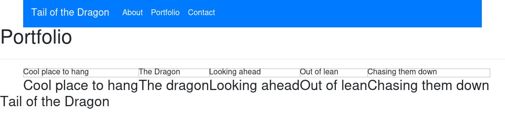
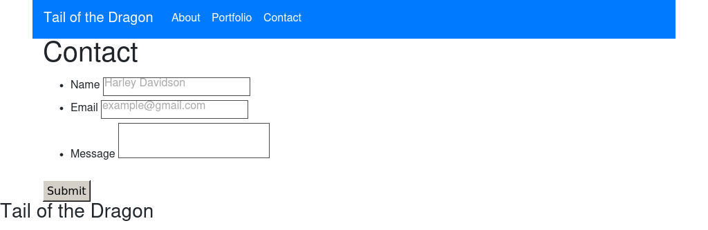

# Update-Responsive-Portfolio
Homework for week 8, this involved updating my original Portfolio added a weather forecast button to the Navbar for the area.

# Description
Homework for week 8 to update Portfolio with new feature

# Requirements
* Functional, deployed application

* GitHub repository with README describing the project

* Navbar must be consistent on each page.

* Navbar on each page must contain links to Home/About, Contact, and Portfolio pages.

* All links must work.

* Must use semantic html.

* Each page must have valid and correct HTML. (use a validation service)

* Must contain your personalized information. (bio, name, images, links to social media, etc.)

* Must properly utilize Bootstrap components and grid system.

Bonus
Using Bootstrap, make a sticky footer and use sub-rows and sub-columns on your portfolio site

# Website
https://rich30041.github.io/Updated-Responsive-Portfolio/.

# Screenshots of application

